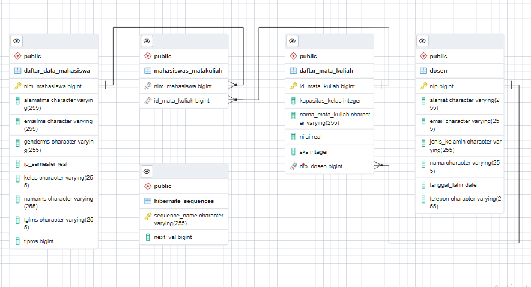
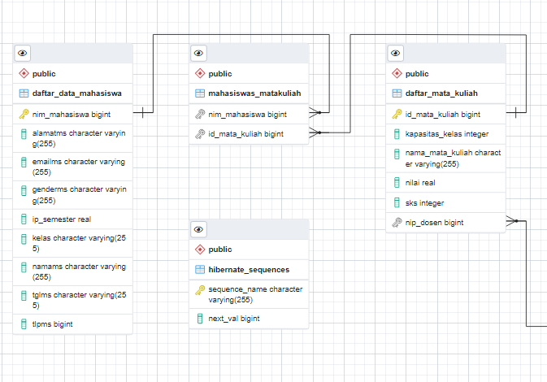
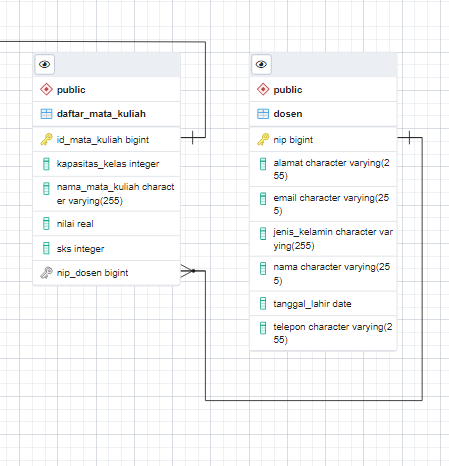
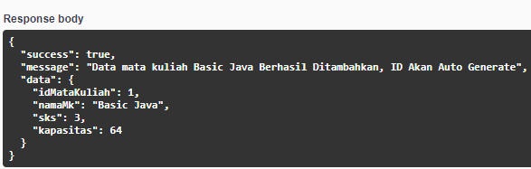
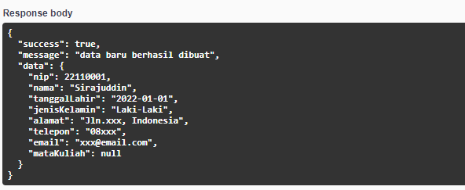
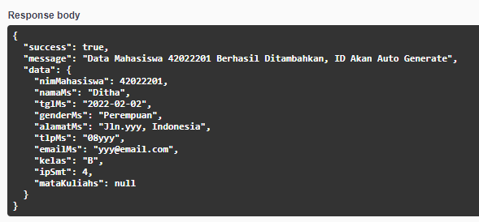

# Detail Projek
#### File ini berisi informasi mengenai projek yang dibuat.
## *Dependencies yang Dipakai*

Projek ini merupakan REST API sederhana mengenai data perkuliahan sekumpulan mahasiswa pada jurusan atau program studi tertentu. 

--- 
Dependencies yang dipakai adalah :
- RESTEasy Reactive
- RESTEasy Reactive Jackson
- Hibernate Validator
- SmallRye OpenAPI
- JDBC Driver - PostgresSQL
- Hibernate ORM with Panache 

---
## *Entitas dan Aturannya*
Terdapat tiga buah entitas pada projek ini. Pada ketiga entitas ini memiliki aturan pada setiap entitas, dimana akan mengembalikan pesan di website pada bagian *response body*.  Ketiga entitasnya sebagai berikut.
1. Mahasiswa 
Mahasiswa memiliki 1 *primary key* yaitu NIM Mahasiswa yang dimulai dengan NIM pertama adalah 4202201, dimana NIM ini akan secara otomatis bertambah satu untuk mahasiswa berikutnya, dan delapan atribut:
> - Nama 
Dengan tipe data String memiliki aturan bahwa atribut ini wajib diisi, dan apabila terdapat kasus atribut tidak diisi akan mengembalikan pesan "Data Nama Mahasiswa Wajib Diisi".

> - Tanggal lahir
Dengan tipe data String memiliki aturan bahwa atribut ini wajib diisi, dan apabila terdapat kasus atribut tidak diisi akan mengembalikan pesan "Data Tanggal Lahir Mahasiswa Wajib Diisi".

> - Jenis kelamin 
Dengan tipe data Gender, sudah ditentukan terdapat dua jenis kelamin yaitu pria dan wanita, memiliki aturan bahwa atribut ini wajib diisi, dan apabila terdapat kasus atribut tidak diisi akan mengembalikan pesan "Data Jenis Mahasiswa Wajib Diisi".

> - Alamat
Dengan tipe data String memiliki aturan bahwa atribut ini wajib diisi, dan apabila terdapat kasus atribut tidak diisi akan mengembalikan pesan "Data Alamat Mahasiswa Wajib Diisi".

> - Nomor telepon
Dengan tipe data Long memiliki aturan bahwa atribut ini wajib diisi, dan apabila terdapat kasus atribut tidak diisi akan mengembalikan pesan "Data Telepon Mahasiswa Wajib Diisi".

> - Email
Dengan tipe data String memiliki aturan bahwa atribut ini wajib diisi, dan apabila terdapat kasus atribut tidak diisi akan mengembalikan pesan "Data Email Mahasiswa Wajib Diisi".

> - Kelas
Dengan tipe data String memiliki aturan bahwa atribut ini wajib diisi, dan apabila terdapat kasus atribut tidak diisi akan mengembalikan pesan "Data Kelas Mahasiswa Wajib Diisi".

> - IP Semester 
Dengan tipe data Float memiliki aturan bahwa atribut ini wajib diisi, dan apabila terdapat kasus atribut tidak diisi akan mengembalikan pesan "Data IP Semester Mahasiswa Wajib Diisi".

2. Dosen
Pada entitas Dosen memiliki sebuah *primary key* yaitu NIP,dengan NIP pertama adalah 22110001 dan akan bertambah satu setiap data dosen baru ditambahkan, dan enam buah atribut, sebagai berikut.
> - Nama
Atribut Nama dengan tipe data String dan harus diisi oleh pengguna pada laman web. Saat kasus atribut ini tidak diisi akan mengembalikan pesan "nama wajib diisi".

> - Tanggal Lahir
Atribut Ta dengan tipe data Date.

> - Jenis Kelamin
Atribut Jenis Kelamin dengan tipe data Gender, dimana sudah ditentukan terdapat dua jenis kelamin yaitu pria dan wanita.

> - Alamat
Atribut Alamat dengan tipe data String dan harus diisi oleh pengguna pada laman web. Saat kasus atribut ini tidak diisi akan mengembalikan pesan "alamat tidak boleh kosong".

> - Telepon 
Atribut Telepon dengan tipe data String.

> - Email
Atribut Email dengan tipe data String dan harus diisi oleh pengguna pada laman web. Saat kasus atribut ini tidak diisi akan mengembalikan pesan "format email harus sesuai".

3. Mata Kuliah
*Primary key* pada entitas Mata Kuliah ialah ID Mata Kuliah dan entitas ini memiliki empat buah atribut.
> - Nama
Atribut Nama memiliki tipe data String dan merupakan atribut yang harus diisi sehingga apabila terdapat kasus atribut ini tidak diisi akan mengembalikan pesan, yaitu "Data Nama Mata Kuliah Wajib Diisi".

> - Nilai
Atribut Nilai memiliki tipe data FLoat dan merupakan atribut yang harus diisi sehingga apabila terdapat kasus atribut ini tidak diisi akan mengembalikan pesan, yaitu "Nilai Wajib Diisi".

> - SKS
Atribut SKS memiliki tipe data Integer dan merupakan atribut yang harus diisi sehingga apabila terdapat kasus atribut ini tidak diisi akan mengembalikan pesan, yaitu "Banyak SKS Wajib DIisi". 

> - Kapasitas
Atribut Kapasitas memiliki tipe data Integer dan merupakan atribut yang harus diisi sehingga apabila terdapat kasus atribut ini tidak diisi akan mengembalikan pesan, yaitu "Kapasitas Kelas Wajib DIisi". 

---
## *Hubungan (Relation)*
Dari ketiga entitas ini, dibuat dua buah relasi (*relations*) yaitu hubungan antara Mahasiswa dengan Mata Kuliah, dan Dosen dengan Mata Kuliah.
1. Hubungan Mahasiswa dengan Mata Kuliah

> Pada hubungan Mahasiswa dengan Mata Kuliah memiliki hubungan *many to many* karena mahasiswa dapat mengambil (*enroll*) lebih dari satu mata kuliah, dan disisi mata kuliah, dapat diikuti oleh lebih dari satu mahasiswa.

2. Hubungan Antara Dosen dan Mata Kuliah

> Pada hubungan antara dosen dan mata kuliah memiliki hubungan *one to many* dimana sebuah mata kuliah hanya dapat memiliki satu dosen utama sedangkan seorang dosen dapat memegang lebih dari satu mata kuliah.

---
## *Format Response*
Format response yang dipakai pada projek ini dengan memggunakan sebuah kelas baru bernama **Notif** sebagai validasi pada setiap *endpoint*. Kelas ini menggunakan *dependency* quarkus-hibernate-validator.
Kelas ini dipakai agar *input* yang diberikan *front end* sesuai dengan data yang diinginkan agar program dapat berjalan sesuai dengan tujuannya dan setiap *endpoint* memiliki balikan yang sama.
Format response akan mengambalikan pesan pada *response body* apabila pengisian data oleh *front end* tidak sesuai dengan data yang diinginkan. 
Pada saat data yang dikirim oleh *front end* sesuai dengan format data yang dibutuhkan web, akan menampilkan: 
> success : true

> message : (Akan disesuaikan dengan masing-masing atribut)

> data : (Berisi data yang dimasukkan *front end* atau diminta *front end*)

Sebagai patokan berhasil tidaknya *front end* mengirimkan atau mendapatkan data adalah *section* *success*, dimana jika bernilai *true* artinya data yang dikirim diterima oleh web dan/atau data yang diminta ada pada *database*, dan bernilai *false* artinya data yang dikirm *front end* tidak diterima oleh web dan/atau tidak ada data yang diinginkan oleh *front end* pada *database*.

Berikut beberapa tampilan *response body* saat data yang dikirimkan oleh *front end* memenuhi aturan entitas:

---
### Anggota Kelompok
- Sirajuddin Hawari
- Ditha Nur Annisa